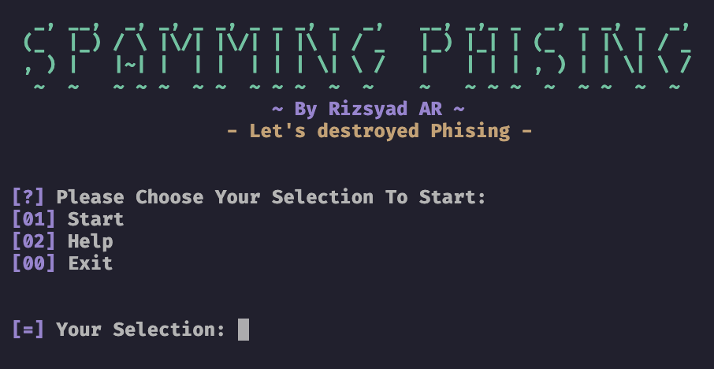

# SPAMING PHISING

Spamming phising with Built-in Fake Credentials Generator. to beat up people who have phishing websites



## How To Use

```bash
git clone https://github.com/rizsyad/spamming-phising.git &&
cd spamming-phising &&
pip install -r requirements.txt &&
chmod +x spam.py &&
./spam.py
```

## Input:

Url - Input url with post request ex: https://target.com/data.php

Post Data - Input Form Data, This form data is in `Inspect Element -> Network Tab -> select target -> payload` <br />
ex: email={email}&password={string}

## Features:

- Fake Credentials Generator.
- Kinda Fast Spam.

## API

{email} - random email <br />
{string} - random string <br />
{number} - random number <br />
